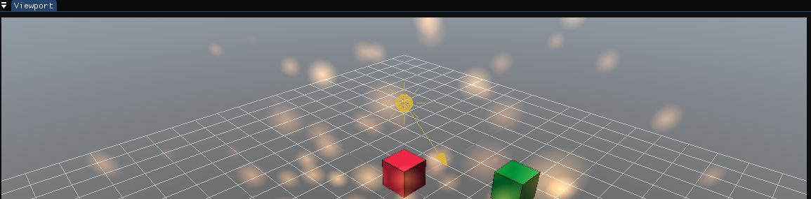

# imguiraylib-game

A **Unity-like 3D game engine and editor**, written from scratch in C++20 — and a
**jet combat game** built with it.


The engine is a static library that knows nothing about the editor; the editor is
an executable that links it. Gameplay is written in Lua, or built visually as node
graphs that generate Lua. Everything here is hand-written on top of raylib, Dear
ImGui and sol2 — there is no game framework underneath doing the interesting
parts.

## What it does

**The editor** looks and works the way you would expect a scene editor to. The 3D
scene renders into an off-screen texture shown inside an ImGui panel, which is the
trick that makes the viewport feel native:

- **Viewport** with an orbit/fly camera, selection outlines and gizmos
- **Game view** rendered through an in-scene camera component, with a HUD
- **Hierarchy** with drag-and-drop parenting that preserves world position and size
- **Inspector** for the transform and every component, with live-editable script
  properties
- **Play / Stop**, which snapshots the scene and restores it afterwards, so
  playing never alters what you authored
- A frame-time and scene-cost readout, because guessing why a frame is slow does
  not work

**The engine** is ECS-lite: entities own components, and a scene graph resolves
world transforms up the parent chain.

| | |
|---|---|
| **Transforms** | quaternion rotation (no gimbal lock), scale that propagates through parents |
| **Rendering** | primitives, `.obj`/`.glb` model loading, procedural Perlin terrain, a gradient skybox, a directional-light shader |
| **Effects** | pooled billboard particles — explosions, sparks, muzzle flashes |
| **Audio** | pooled voices for overlapping one-shots, per-play pitch variation, looping streams |
| **Collision** | opt-in colliders — sphere, box or capsule, with local offset and rotation |
| **Scripting** | Lua per component via sol2, each with its own sandboxed interpreter |
| **Serialization** | scenes and node graphs as human-readable JSON |



## Gameplay is Lua

Every script may implement `on_start`, `on_update` and `on_destroy`, and expose a
`properties` table whose entries become live-editable Inspector fields:

```lua
properties = {
    speed      = 200,   -- shown in the Inspector, saved per entity
    hit_radius = 1.0,
}

function on_update(entity, dt)
    entity.transform:translate_local(0, 0, -properties.speed * dt)

    local p = entity.transform.position
    local target = scene.hit("enemy", p.x, p.y, p.z, properties.hit_radius)
    if target ~= nil then
        scene.damage(target, 1)
        fx.burst("spark", p.x, p.y, p.z)
        audio.play("impact")
        scene.destroy(entity)
    end
end
```

Scripts reach the engine through small tables: `scene` (find, spawn, destroy,
damage, collision queries), `transform` (vector and quaternion maths), `input`,
`hud`, `fx`, `audio` and `light`.

**Tuning data lives in Lua too, not in C++.** Particle effects
(`assets/scripts/effects.lua`) and sounds (`assets/scripts/sounds.lua`) are
declared as data and re-read every time you press Play, so retuning an explosion
never means recompiling:

```lua
fx.define("explosion", {
    count = 60, speed_min = 4.0, speed_max = 26.0,
    life_min = 0.5, life_max = 1.4,
    color_start = {255, 185, 90, 215}, color_end = {120, 30, 10, 0},
    gravity = -9.0, drag = 2.2, up_bias = 0.35,
})
```

## Visual scripting

A complete **data-flow node language** that generates Lua. Typed pins
(exec/float/bool), variables, Inspector-exposed parameters, branches and counting
loops. Every gameplay script in the game has also been reproduced as a graph and
verified to generate equivalent code.

Nodes cover values and maths, entity reads and writes, spawning, tag queries,
AI helpers, and the presentation layer — an effect or sound is picked from a
dropdown of whatever the data files define, so adding one needs no C++ and no
guessing at names.

## The game

Fly a jet on a momentum-based flight model — velocity is a separate vector that
aerodynamics bend toward the nose, so climbing trades speed for altitude and
diving buys it back. Dogfight enemy aircraft that chase, lead their shots and
spread out to avoid crowding. Score on kills, survive escalating waves, restart
with **R**.

## Building

Everything is fetched and pinned by CMake — nothing to install by hand.

```bash
cmake -B build
cmake --build build --target editor --config Debug
```

Or open the folder in Visual Studio 2022/2026 and press F5. The **first configure
downloads and compiles the dependencies and takes several minutes**; later builds
are fast.

There is also an `x64-Release` configuration — worth using when *playing* rather
than debugging, since Debug builds carry checked iterators through every
per-entity loop.

**Requirements:** a C++20 compiler and CMake 3.24+. Developed on Windows with
MSVC; the only platform-specific code is the native file dialog
(`src/engine/FileDialog.cpp`).

## Layout

```
src/engine/     the engine, as a static library
  Scene.*         entities, scene graph, serialization, collision queries
  Components.*    every component, plus the whole Lua API
  Lighting.*      the directional light and its shader
  Particles.*     the effect pool
  Audio.*         sound loading, voice pooling, loops
src/editor/     the editor executable
  main.cpp        panels, viewport, HUD, gizmos, play/stop
  ScriptGraph.*   the visual scripting language and its code generator
assets/
  scripts/        Lua gameplay, plus effects.lua and sounds.lua as data
  graphs/         node graphs (JSON)
  shaders/        skybox and lighting (GLSL 330)
  scenes/         saved scenes (JSON)
```

## Status

| Milestone | |
|---|---|
| Flight model and chase camera | ✅ |
| Weapons, health and hit detection | ✅ |
| Enemy AI and waves | ✅ |
| Presentation — models, terrain, HUD, skybox, lighting, particles | ✅ |
| Audio — engine and bindings done, sound files not included | 🔶 |
| Game loop — score, waves, game over, restart | ✅ |
| Rigid-body physics (Jolt) — colliders done, bodies next | 🔶 |

The full feature plan lives in `jetgame_plan.xlsx`.

**Not in the repository:** sound files (`assets/sounds/` explains what is
expected) and a few large model files, which are kept local. Both degrade
gracefully — a missing sound is silent and reported in the toolbar; a missing
model falls back to a primitive shape.

## Built with

[raylib](https://github.com/raysan5/raylib) ·
[Dear ImGui](https://github.com/ocornut/imgui) (docking) ·
[rlImGui](https://github.com/raylib-extras/rlImGui) ·
[imgui-node-editor](https://github.com/thedmd/imgui-node-editor) ·
[Lua](https://www.lua.org/) ·
[sol2](https://github.com/ThePhD/sol2) ·
[nlohmann/json](https://github.com/nlohmann/json)

Each is fetched at a pinned version and keeps its own licence.
