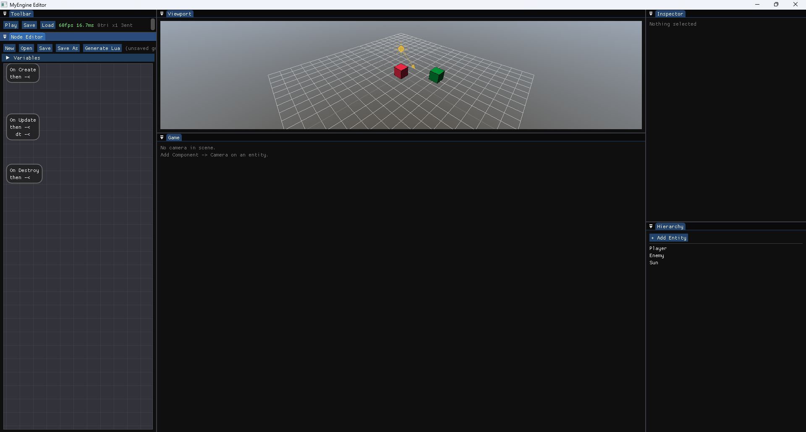
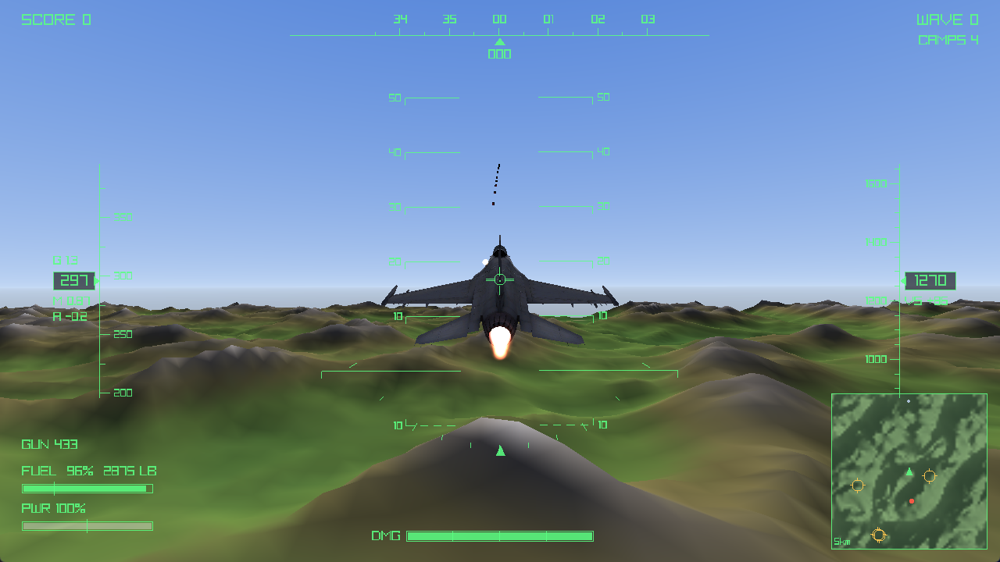
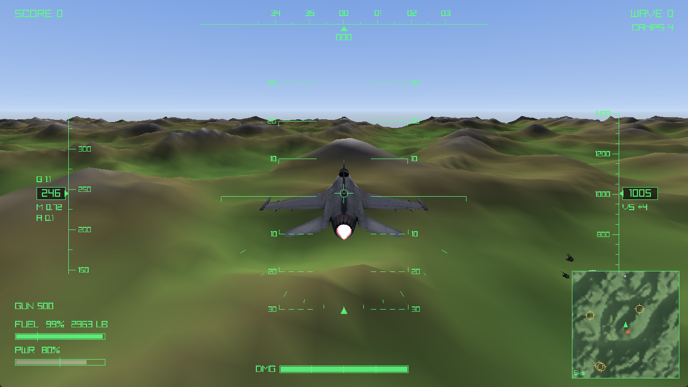

# imguiraylib-game

A **3D game engine and editor**, written from scratch in C++20 — and
**Winchester**, a jet combat game built with it.

_Winchester_ — brevity code for "out of ammunition."



The engine is a static library that knows nothing about the editor. Two
executables link it: the **editor**, and the **game** — a standalone runtime with
no editor in it, which is what a player downloads. Gameplay is written in Lua, or
built visually as node graphs that generate Lua. Everything here is hand-written
on top of raylib, Dear ImGui and sol2; the only large pieces not written here are
the physics and flight-model solvers, and both are quarantined behind one file
each.

## Play it

Builds are on the [Releases](https://github.com/Ali-Gumus/imguiraylib-game/releases)
page — unzip and run `game.exe`. Nothing to install; the C++ runtime ships with
it.

| | |
|---|---|
| **W / S** | pitch (W raises the nose) |
| **A / D** | roll |
| **Q / E** | rudder |
| **Shift / Ctrl** | throttle — the top of the range lights the afterburner |
| **G** | landing gear |
| **Space** | guns |
| **R** | restart after a game over |
| **Escape** | quit |

The controls **ramp rather than snap**. A keyboard has two positions and a stick
has a continuum, so mapping a key straight to a control surface makes tapping W a
genuine 9 g snatch — which is most of why a real flight model feels unflyable
from a keyboard.

## What it does

**The editor** works the way you would expect a scene editor to. The 3D scene
renders into an off-screen texture shown inside an ImGui panel, which is the
trick that makes the viewport feel native:

- **Viewport** with an orbit/fly camera, selection outlines and gizmos
- **Game view** rendered through an in-scene camera component, with the HUD
- **Hierarchy** with drag-and-drop parenting that preserves world position and size
- **Inspector** for the transform and every component, with live-editable script
  properties
- **Node editor** for visual scripting
- **Script API** panel — a searchable reference generated from the bindings
  themselves, so it cannot go stale
- **Build** panel — builds the standalone game and streams the compiler's output
  into a log while the editor keeps running
- **Play / Stop**, which snapshots the scene and restores it afterwards, so
  playing never alters what you authored

**The engine** is ECS-lite: entities own components, and a scene graph resolves
world transforms up the parent chain.

| | |
|---|---|
| **Transforms** | quaternion rotation (no gimbal lock), scale that propagates through parents |
| **Rendering** | primitives, `.obj`/`.glb` model loading, multi-octave procedural terrain, a gradient skybox, a directional-light shader |
| **Physics** | Jolt rigid bodies — static/kinematic/dynamic, a heightfield terrain surface, contact events delivered to scripts, continuous collision for projectiles |
| **Flight model** | JSBSim — a real aerodynamic solver flying a stock F-16, with stalls, fuel burn, landing gear and ground reactions |
| **Effects** | pooled billboard particles — explosions, sparks, muzzle flashes |
| **Audio** | pooled voices for overlapping one-shots, per-play pitch variation, looping streams, positional playback |
| **Scripting** | Lua per component via sol2, each with its own sandboxed interpreter |
| **Serialization** | scenes and node graphs as human-readable JSON |



## Gameplay is Lua

Every script may implement `onStart`, `onUpdate`, `onDestroy`, `onCollision` and
`onDrawHud`, and expose a `properties` table whose entries become live-editable
Inspector fields, saved per entity:

```lua
properties = {
    speed  = 860,   -- metres per second
    damage = 1,
}

function onStart(entity)
    Scene.setCollider(entity, "sphere", 0.25)
    -- mass, gravity factor, and continuous collision so a fast round
    -- cannot pass through a target between two frames
    Physics.setBody(entity, "dynamic", 0.05, 1.0, true)

    local f = entity.transform:forward()
    Physics.setVelocity(entity, f.x * properties.speed,
                                f.y * properties.speed,
                                f.z * properties.speed)
end

-- Reported by the physics simulation: what was hit, how fast, and where.
function onCollision(entity, other, speed, x, y, z)
    Scene.damage(other, properties.damage)
    Fx.burst("spark", x, y, z)
    Audio.playAt("impact", x, y, z)
    Scene.destroy(entity)
end
```

Scripts reach the engine through small tables: `Scene` (find, spawn, destroy,
damage, terrain height), `Transform` (vector and quaternion maths), `Physics`,
`Input`, `Hud`, `Fx`, `Audio`, `Draw` and `Light`. Tables are PascalCase,
functions and hooks camelCase; `properties` keys stay snake_case because scene
files key their per-entity overrides by those exact names.

**Tuning data lives in Lua too, not in C++.** Particle effects
(`assets/scripts/effects.lua`), sounds (`sounds.lua`) and model set-ups
(`models.lua`) are declared as data and re-read every time you press Play, so
retuning an explosion never means recompiling:

```lua
Fx.define("explosion", {
    count = 60, speed_min = 4.0, speed_max = 26.0,
    life_min = 0.5, life_max = 1.4,
    size_start = 1.1, size_end = 0.12,
    color_start = {255, 185, 90, 215}, color_end = {120, 30, 10, 0},
    gravity = -9.0, drag = 2.2, up_bias = 0.35,
})
```

## Visual scripting

A complete **data-flow node language** that generates Lua. Typed pins
(exec/float/bool), variables, Inspector-exposed parameters, branches and counting
loops.

Nodes cover values and maths, entity reads and writes, spawning, tag queries,
AI helpers, and the presentation layer — an effect or sound is picked from a
dropdown of whatever the data files define, so adding one needs no C++ and no
guessing at names. The graph is the source of truth; the generated `.lua` is an
artifact.

## The game



Fly an F-16 over a landscape of ridges and valleys. **The flight model is
JSBSim**, so the aircraft is flown rather than driven: it stalls if you ask too
much of it, trades speed for altitude, runs its tanks dry if you leave the
burner in, and can be landed on its gear or flown into a hillside.

Two fronts. Enemy aircraft chase, spread out to avoid crowding, climb over
terrain and lead their shots. On the ground, fortified camps defended by
anti-aircraft vehicles that track the player and lead the shot — a shell crosses
two kilometres in a little over two seconds, in which time a jet moves a
kilometre, so firing at where it *is* misses by more than an airfield.

Score on kills, watch the radar for contacts and targets, restart with **R**.

Everything is at **real-world scale** — one world unit is one metre, and the
tunables are derived from the real aircraft rather than dialled in by feel.

## Building

Everything is fetched and pinned by CMake — nothing to install by hand.

```bash
cmake -B build
cmake --build build --config Release --target editor
```

Or open the folder in Visual Studio 2022/2026 and press F5. The **first configure
downloads and compiles the dependencies and takes several minutes**; later builds
are fast.

**Use a Release build to play.** Debug carries checked iterators through every
per-entity loop and drops frames; Release holds 58–60 fps.

Three targets:

| Target | |
|---|---|
| `editor` | the editor |
| `game` | the standalone runtime, with assets copied beside the exe |
| `package_game` | collects the exe, its assets and the C++ runtime DLLs into `dist/<config>/`, ready to zip |

`package_game` is also what the editor's **Build** panel runs, so a release can be
made without leaving the editor.

**Requirements:** a C++20 compiler and CMake 3.24+. Developed on Windows with
MSVC; the platform-specific code is the native file dialog
(`src/engine/FileDialog.cpp`) and the build-panel process launcher
(`src/editor/BuildRunner.cpp`).

## Layout

```
src/engine/       the engine, as a static library
  Scene.*           entities, scene graph, serialization
  components/       one file per component
  bindings/         one file per Lua API subject, each carrying its own docs
  Physics.*         Jolt rigid bodies — the ONLY file that includes Jolt
  FlightModel.*     JSBSim — the ONLY file that includes JSBSim
  Lighting.*        the directional light and its shader
  Particles.*       the effect pool
  Audio.*           sound loading, voice pooling, loops
src/editor/       the editor executable
  main.cpp          panels, viewport, gizmos, play/stop
  ScriptGraph.*     the visual scripting language and its code generator
  BuildRunner.*     runs CMake in the background for the Build panel
src/game/         the standalone game executable
assets/
  scripts/          Lua gameplay, plus effects/sounds/models as data
  graphs/           node graphs (JSON)
  scenes/           saved scenes (JSON)
  shaders/          skybox and lighting (GLSL 330)
  models/           meshes
  sounds/           audio files
  jsbsim/           the aircraft description the flight model reads at runtime
  game.json         which scene the standalone game launches, and its window
```

Third-party headers are quarantined deliberately: Jolt appears only in
`Physics.cpp` and JSBSim only in `FlightModel.cpp`, because both bring short,
common type names into a project that already fights raylib's globals.

## Status

| | |
|---|---|
| Flight — quaternion orientation, chase camera | ✅ |
| Weapons, health and hit detection | ✅ |
| Enemy aircraft — chase, separation, lead prediction, terrain avoidance | ✅ |
| Presentation — models, terrain, HUD, skybox, lighting, particles | ✅ |
| Audio — gunfire, explosions, a throttle-driven engine loop | ✅ |
| Game loop — score, waves, game over, restart | ✅ |
| Rigid-body physics (Jolt) | ✅ |
| Ground war — camps, AA emplacements, radar marks | ✅ |
| Aerodynamic flight model (JSBSim) | ✅ |
| Standalone game build and packaging | ✅ |
| Main menu | ⬜ |

The full feature plan lives in `jetgame_plan.xlsx`.

Releases before a main menu exists are marked **pre-release**: the game drops you
straight into the air.

A missing asset degrades rather than crashes — a missing model falls back to a
primitive shape, and a missing sound is silent and flagged in the toolbar.

## Built with

[raylib](https://github.com/raysan5/raylib) ·
[Dear ImGui](https://github.com/ocornut/imgui) (docking) ·
[rlImGui](https://github.com/raylib-extras/rlImGui) ·
[imgui-node-editor](https://github.com/thedmd/imgui-node-editor) ·
[Lua](https://www.lua.org/) ·
[sol2](https://github.com/ThePhD/sol2) ·
[nlohmann/json](https://github.com/nlohmann/json) ·
[Jolt Physics](https://github.com/jrouwe/JoltPhysics) ·
[JSBSim](https://github.com/JSBSim-Team/jsbsim)

Each is fetched at a pinned version and keeps its own licence.
